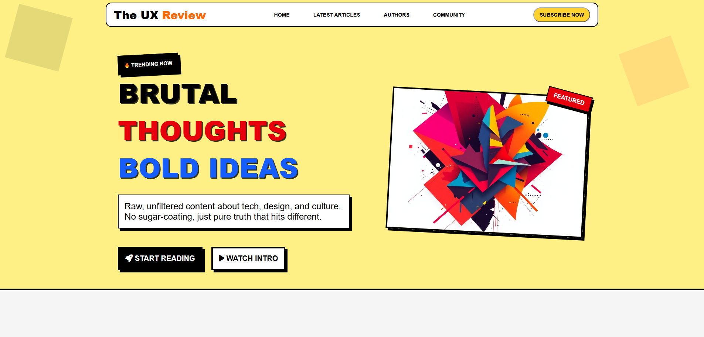
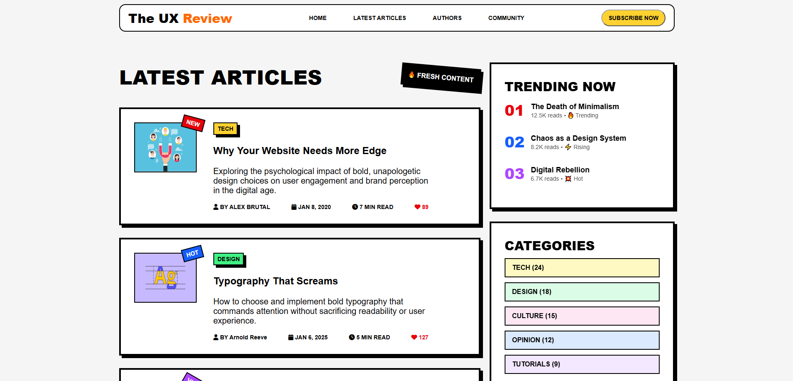
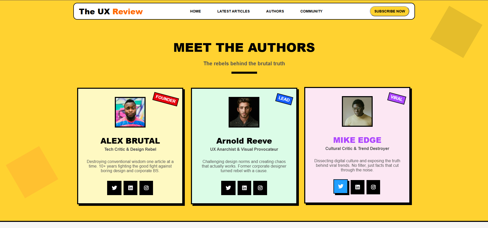

# Neubrutalism Style

A landing page built using the **Neubrutalism** design style — a bold, high-contrast visual approach characterized by thick black borders, flat offset shadows, saturated colors, and an unpolished, raw aesthetic.

## Overview

This project demonstrates the neubrutalist design trend applied to a real webpage layout, focusing on strong visual hierarchy through borders, shadows, and typography rather than gradients or soft UI elements.

## Screenshots







## Design Characteristics

- **Bold Borders** — Thick black outlines around all major elements
- **Flat Offset Shadows** — Hard-edged drop shadows (no blur) shifted diagonally for a 3D "sticker" effect
- **High-Contrast Colors** — Saturated primary/secondary colors against black and white
- **Raw, Unapologetic Layout** — Minimal rounding, intentional "unfinished" feel
- **Bold Typography** — Heavy font weights for strong visual impact
- **Fully Responsive** — Adapts across mobile, tablet, and desktop screens

## Tech Stack

- HTML5
- CSS3 (custom neubrutalist styling in `css/`)

## Project Structure

neubrutalism-style/
├── css/ # Stylesheets
├── imgs/ # Images and icons
└── index.html # Main page

## Getting Started

1. Clone the repository:
```bash
   git clone https://github.com/shahendamohamed22/neubrutalism-style.git
```
2. Open `index.html` in your browser — no build step required.

## Live Demo

https://shahendamohamed22.github.io/neubrutalism-style/

## Author

**Shahenda Mohamed**
GitHub: [@shahendamohamed22](https://github.com/shahendamohamed22)